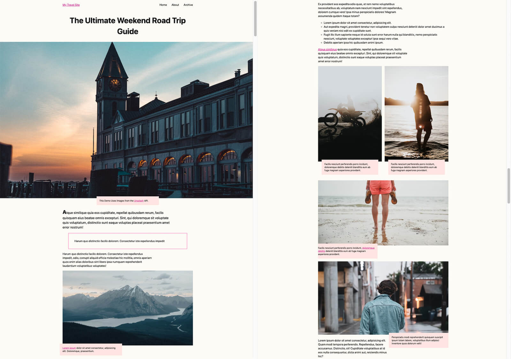

# Exploration of `content-visibility` CSS property

The [`content-visibility`](https://developer.mozilla.org/en-US/docs/Web/CSS/content-visibility) property provides control over when elements are rendered, some rendering steps can be skipped for elements that are not yet needed by an user. This can make the initial page load faster. I want to explore a range of scenarios to see the true effect on performance.

## Run the examples

I used [vite](https://vitejs.dev/) to run this as a mini-website. Just install the dependency (`npm install`) and run `vite`.

## Performance auditing

I deployed this as a website to Netlify to audit the pages. I performed the audit using Chrome DevTools v116 in incognito mode. I used an older laptop a Lenovo T460. AFAIK hardware and network issues will affect results.

## Example 1 - Landing page

This is a tasteful landing page for the artist Angèle, designed/coded by Rafaela
Lucas.

It is of typical size with 4 major sections. The main nav is hidden always and can be opened via a hamburger menu.It has some
JavaScript to make a slideshow widget as part of the hero section.

I think it is a good candidate for realistically testing what `content-visibility` can do for a typical webpage.

### Scenarios explored

I will test some scenarios to see the impact that the property can have
when applied to different parts of the page.

1. Default style.
1. Nav main menu has `content-visibility:auto` applied to it.
1. Nav main menu with `content-visibility:auto` and `content-intrinsic-size: 100vw 100vh;` specified.
1. Nav main menu with `content-visibility:hidden` specified. Switches value to `visible` when opened.
1. Lower 3 sections have `content-visibility:auto` applied.
1. Lower 3 sections have `content-visibility:auto` and `contain-intrinsic-size` specified.
1. Lower 3 sections have `content-visibility:hidden` applied.
1. Lower 3 sections have `content-visibility:hidden` and `contain-intrinsic-size` specified.
1. Apply `content-visibility:auto` to hero section to see if a penalty is incurred. Don't repeat this!!

### Performance audit results

| **#** | **Scenario**                                                                                       | **Loading** | **Scripting** | **Rendering** | **Painting** | **System** | **Idle** | **Total** |
|-------|----------------------------------------------------------------------------------------------------|-------------|---------------|---------------|--------------|------------|----------|-----------|
| 1     | Default                                                                                            | 21          | 6             | 114           | 30           | 178        | 4608     | 4957      |
| 2     | Nav main menu has `content-visibility:auto` applied to it                                          | 34          | 7             | 181           | 82           | 212        | 4479     | 4995      |
| 3     | Nav main menu with content-visibility:auto and content-intrinsic-size: 100vw 100vh; specified.     | 22          | 6             | 106           | 22           | 128        | 4715     | 4999      |
| 4     | Nav main menu with `content-visibility:hidden` specified.                                          | 30          | 7             | 144           | 21           | 155        | 4752     | 5109      |
| 5     | Lower 3 sections have content-visibility:auto applied.                                             | 19          | 5             | 61            | 11           | 145        | 4744     | 4985      |
| 6     | Lower 3 sections have `content-visibility:auto` and `contain-intrinsic-size` specified.            | 23          | 5             | 64            | 16           | 137        | 4673     | 4918      |
| 7     | Lower 3 sections have content-visibility:hidden applied.                                           | 18          | 4             | 69            | 22           | 135        | 4748     | 4996      |
| 8     | Lower 3 sections have `content-visibility:hidden` and `contain-intrinsic-size` specified.          | 22          | 5             | 100           | 40           | 145        | 4880     | 5192      |
| 9     | Apply content-visibility:auto to hero section to see if a penalty is incurred. Don't repeat this!! | 32          | 5             | 103           | 22           | 156        | 4542     | 4860      |

## Example 2 - Travel blog post

This is the demo discussed in the web.dev article - [content-visibility: the new CSS property that boosts your rendering performance](https://web.dev/content-visibility). It is a travel blog that contains a set of stories, pictures, some descriptive text, and some random <code>iframe</code>s!

### Scenarios explored

1. Default style.
1. With `content-visibility:auto` applied to a few sections.

### Performance audit results

The results I found were a lot more modest than web.dev teams result. For the second scenario, I observed a rendering time of 117ms, they observed 23ms. Perhaps, the hardware they used had some impact on that.

| **#** | **Scenario**                                             | **Loading** | **Scripting** | **Rendering** | **Painting** | **System** | **Idle** | **Total** |
|-------|----------------------------------------------------------|-------------|---------------|---------------|--------------|------------|----------|-----------|
| 1     | Default style                                            | 36          | 4             | 237           | 277          | 548        | 8888     | 9990      |
| 2     | With `content-visibility:auto` applied to a few sections | 66          | 2             | 117           | 157          | 421        | 9459     | 10222     |
